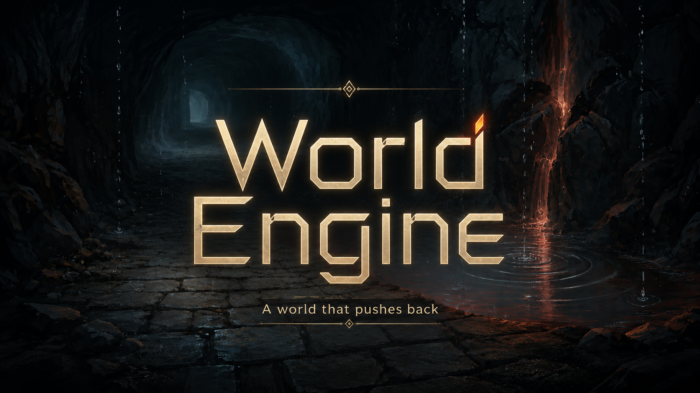

# World Engine

There's a chest. It's locked.

 The objective says open the chest. But, the game does not tell you how or even know how. 
 
 There's no designated key waiting in a designated drawer. The lock might be jammed, in which case the key you find won't help. So you wander.

A few rooms later you find an axe. The axe wasn't placed there to solve the chest — nothing is placed to solve anything. Nothing was placed at all until you walked in the room. 

But you're holding an axe and there's a locked chest, and when you swing it at the lid, the world agrees that's what happens.

Rooms, objects, and complications get generated turn by turn as you explore them. Some of what shows up will turn out to matter. You won't know which until you try something.

Replay the same preset and the axe might not exist. Maybe there's a crowbar. Maybe the chest is rusted shut and now you're looking for water. 

Maybe the chest contains something you really wish it hadn't. The seed scenario is the same; what fills it in isn't.

You can also skip the presets entirely and start in an empty open world — type what you do, and the world assembles itself around you.

> **Status:** still being shaped. The engine grows sharper between sessions; expect occasional rough edges and behavior that changes as it learns.

**Demo:** [Gameplay video](https://www.youtube.com/watch?v=_BUib3K9mK4) — streaming TTS narration and per-turn image generation in action.

## Quickstart

You'll need [Bun](https://bun.com) and an OpenAI-compatible local model server. The defaults assume [LM Studio](https://lmstudio.ai/) on port 1234.

1. **Install dependencies**
   ```bash
   bun install
   ```

2. **Start your local model server.** In LM Studio, load a capable instruction-tuned model and start the server on the default port (`http://localhost:1234`). The defaults in `src/api.ts` point both narrator and archivist at `google/gemma-3-12b` — a 12B-class model that handles the locality and objective rules well on modest hardware.

   Smaller 4B-class models often work too but tend to drift on nuanced rules. Larger models (Gemma 3 27B, Llama 3.1 70B, etc.) handle the rules with even more nuance if you have the VRAM. Other OpenAI-compatible servers (Ollama with the OpenAI shim, llama.cpp's `llama-server`, vLLM, etc.) work the same way. The endpoint and model names are constants at the top of `src/api.ts` — edit those lines to point at whatever you're running.

3. **Run the web app**
   ```bash
   bun --hot src/server.ts
   ```
   Open http://localhost:3000.

   First load shows the title screen. Pick a story and start typing what you do.

### Narration (optional)

The web app can read each turn aloud using Google's Gemini TTS. Audio streams chunk-by-chunk over a WebSocket so playback starts within ~1 second of the narrative appearing.

> **Note:** this replaces the previous local-Piper narration. I tried hard to keep narration free and local, but no local TTS I tested sounded good enough to listen to for hours of play. Gemini TTS needs a Google API key (Google AI Studio has a free tier that covers light play) — set `GEMINI_API_KEY` in `.env`. A proper in-app configuration screen for swapping providers, voices, and pasting in a key is planned; for now it's `.env` only.

Toggle narration in-app via the **voice off / voice on** button in the action bar. Audio is cached per turn; replays are instant. Disable any time — settings persist via `localStorage`.

### Images (optional)

Each turn has a `▦` button stacked under the speaker icon in the margin. Click it and the turn's narrative is sent to Google's `gemini-2.5-flash-image` (Nano Banana). The result drops in above the text as an establishing shot for the scene you just read. The model generates 1:1; the timeline crops it to a cinematic strip — **click any image to open the full square in a fullscreen lightbox** (ESC or click outside to close). Cached per turn; the button greys out once an image exists.

> **Note:** like narration, this is **never automatic** — images only generate when you click `▦`. Uses the same `GEMINI_API_KEY` you already set for narration. Cost is per-image and falls under Google AI Studio's free tier for light play. The same future in-app configuration screen will cover image settings.

### Gallery

When a turn produces an image you want to keep, click the ★ button next to the `▦` — it saves the image to the server's `media/` directory. To browse everything you've saved, type `/gallery` in the chat window. A wide modal opens with the selected image on top, prev/next arrows on either side, and a horizontally-scrolling thumbnail strip below. Click any thumbnail to jump to it, click the big image to lightbox it, ← / → keys to navigate, ESC to close.

> Galleries are local to your machine right now — every player on this server shares the same `media/` folder. With the planned multi-user setup, each player will have their own scoped gallery.

### Configuration

All settings live in `.env`. Bun loads it automatically — no `dotenv` needed.

```bash
# Required for narration and per-turn images.
GEMINI_API_KEY=your_key_here

# Optional: where to find your local OpenAI-compatible endpoint
# (LM Studio by default). Override if your server runs on a different
# port, a different host, or behind basic auth (include user:pass@).
LM_STUDIO_URL=http://localhost:1234

# Optional: which local model id LM Studio should serve for each
# pipeline stage. Each id must match what LM Studio reports at
# /v1/models. See docs/local-narrator-bake-off.md for picks.
#
# LOCAL_MODEL is the default for all three local stages; the per-stage
# overrides let you mix-and-match — e.g. a fast 3B model for the
# narrator while keeping a reliable 12B model on the archivist's
# structured-JSON extraction.
LOCAL_MODEL=google/gemma-3-12b
LOCAL_NARRATOR_MODEL=mistralai/ministral-3-3b      # optional override
LOCAL_ARCHIVIST_MODEL=google/gemma-3-12b           # optional override
LOCAL_INTERPRETER_MODEL=nvidia/nemotron-3-nano-4b  # optional override; validated 22/22 on the lab testbed

# Optional: per-stage sampling. Defaults shown — raise narrator
# temp for more creative prose, keep archivist temp low so its
# structured-JSON stays reliable, interpreter temp at 0 for
# deterministic classification. top_p left unset = LM Studio default.
LOCAL_NARRATOR_TEMP=0.95
LOCAL_ARCHIVIST_TEMP=0.5
LOCAL_INTERPRETER_TEMP=0
# LOCAL_NARRATOR_TOP_P=0.95
# LOCAL_ARCHIVIST_TOP_P=0.9
# LOCAL_INTERPRETER_TOP_P=1.0

# Optional: route the narrator through Gemini for richer prose.
# Defaults to the local OpenAI-compatible endpoint.
NARRATOR_PROVIDER=gemini                # gemini | local
NARRATOR_GEMINI_MODEL=gemini-2.5-flash  # optional; flash is the default

# Optional: route the interpreter through Gemini for robust intent parsing.
# Defaults to the local OpenAI-compatible endpoint.
INTERPRETER_PROVIDER=gemini                # gemini | local
INTERPRETER_GEMINI_MODEL=gemini-2.5-flash  # optional; flash is the default
```

> **Turning the Gemini narrator on upgrades both features at once.** Gemini writes noticeably tighter, more sensory prose than a 12B local model. And because the image generator's prompt _is_ the narrator's output, a sharper narrative also produces a sharper image downstream — better text feeds better pictures. Cost is one extra Gemini call per turn (~$0.0002 on Flash); the archivist still runs locally, and the interpreter can be routed independently via `INTERPRETER_PROVIDER` (see above).

### Recommended local narrator models

When `NARRATOR_PROVIDER=local` (the default), the narrator hits whatever OpenAI-compatible endpoint is at `http://localhost:1234` — typically [LM Studio](https://lmstudio.ai/). Quality varies wildly across local models. Picks after a 12-model bake-off ([full results](docs/local-narrator-bake-off.md)):

- **🥇 `google/gemma-3-12b`** — ~3s/turn, ~125 words. Introduces named NPCs and unfolding mysteries on richer turns; in-character narrator voice. Best overall storyteller and the current baseline.
- **🥈 `mistralai/devstral-small-2-2512`** — ~5s/turn. World-stack-conservative: names established canonical items by their nouns rather than inventing parallel facts. Use when you want the established world to drive reveals.
- **🥉 `qwen/qwen3.6-35b-a3b`** with **thinking off** — ~3s/turn, vivid cinematic detail. Fastest of the viable picks that works as the whole pipeline.
- **⚡ `mistralai/ministral-3-3b`** — ~0.8s/turn, ~95 words. Speed pick. With the current `NARRATOR_SYSTEM` it produces vivid concrete prose, names canonical world-stack items, and follows the ending rule. **Caveat:** only viable as the narrator slot — the same model on the archivist breaks LOCATE objectives. Pair with a 12B archivist via the recipe below.

> **Thinking models are mostly unusable** for an interactive narrator with this prompt. With thinking on, most run 30–50s per turn and many burn their full token budget on reasoning, producing empty narrative content. The one disciplined exception is `nvidia/nemotron-3-nano-omni` (also recommended with thinking off).
>
> Avoid: `microsoft/phi-4-reasoning-plus` (3rd-person narration, RPG-style asides), `mystral-uncensored-rp-7b` (leaks prompt structure into prose).

### Recommended local archivist models

The archivist's job — extracting world entries, threads, location descriptions, and `achievedObjectiveIndices` as structured JSON — is the small-model-hostile workload in the pipeline. Multi-rule prompts plus grammar-constrained output exceed what 3-4B models reliably handle. Verdict so far:

- **🥇 `google/gemma-3-12b`** — the only model validated end-to-end for this role. Reliably fires LOCATE objectives when the player arrives and the narrative names the canonical target, supersedes entries on item state changes, holds the archivist's 30+ rules under prompt pressure. Validated 2026-05-11 with per-stage routing.

Other 12B-class candidates from the bake-off (`mistralai/devstral-small-2-2512`, `supergemma4-26b-uncensored-v2`) probably work too but haven't been verified for the archivist role yet. **Don't drop below 12B for this slot** — observed failure modes include `achievedObjectiveIndices: []` even when the narrative clearly names the target, dropped canonical item names from entries, and supersession bugs (old + new state both kept).

#### Fast fully-local recipe — narrator on 3B, archivist on 12B, interpreter on 4B

The three stages have different jobs and different model needs:

- **Narrator** writes prose. A small fast model (3B) handles the current narrator prompt well.
- **Archivist** does structured-JSON extraction (objective completion, entry updates). Needs a capable 12B-class model to hold the 30+ rules under prompt pressure.
- **Interpreter** classifies the player's input into one of six action enums. A small fast model is plenty — `nvidia/nemotron-3-nano-4b` hit 22/22 deterministic on the lab testbed (lab/local-models, v3-movement-verbs prompt). Way faster than the 12B baseline.

```env
NARRATOR_PROVIDER=local
INTERPRETER_PROVIDER=local
LOCAL_MODEL=google/gemma-3-12b
LOCAL_NARRATOR_MODEL=mistralai/ministral-3-3b
LOCAL_ARCHIVIST_MODEL=google/gemma-3-12b
LOCAL_INTERPRETER_MODEL=nvidia/nemotron-3-nano-4b
```

Sub-second narrator turns, deterministic interpreter classification, LOCATE objectives still fire correctly. Narrator + archivist validated end-to-end with the Lunar Rescue preset 2026-05-11; interpreter prompt + model pair validated 2026-05-12 on the testbed (22/22 across all 22 hand-labeled cases).

## How it works

Each turn runs three model passes:

1. **Interpreter** parses the player's input into a structured action (movement, look, interact, freeform).
2. **Narrator** receives the established world state + active threads + the parsed action and writes 1–3 sentences of narrative.
3. **Archivist** reads the narrative and extracts new world facts and any objectives that just got achieved.

The world state lives in `world-stack.json` — an append-mostly list of established facts (`damaged transmitter half-buried in regolith`), an active-threads list, an objectives list, and a position. Every turn appends to a single `play-log.jsonl` for postmortem.

## Tips

- **Presets are fun; Empty World is where the real magic happens.** The bundled stories (Cellar of Glass, Lunar Rescue, The Last Train) give you a setting and a goal — great for a focused session or first-time play. But for the *best* experience, start with no preset and just type your opening line. You genuinely don't know what you're going to get, and that's the point — your mind shapes the adventure. The world grows around whatever premise you bring.
- **The world builds as you look.** Rooms, objects, and details only exist after the narrator establishes them — and once established, the engine has to honor them in later turns. A tile you walked straight through is thin; a tile you actually examined has weight. Spending turns on `look`, `examine`, and `search` isn't downtime — it's what makes the world feel real to come back to.
- **Seed the scene on turn one in freeplay.** Empty World mode has no preset, so the narrator improvises a setting from your first input. `look around` gives it nothing to anchor to and you'll get a generic room. A scene-setting line does the work for you:
  > Don't open the airlock! We're on a deep-space station with over 300,000 people aboard — open it and you'll suck them all into space.

  One sentence, and the narrator has a location, stakes, and a constraint to honor. From there the world fills itself in around you.

## Recent changes

- **Image gallery + lightbox.** New `/gallery` slash command opens a wide modal listing every image in the server's `media/` directory — big preview on top, prev/next arrows, scrolling thumbnail strip below, ← / → keys + ESC. Each turn's generated image gets a new ★ button to save it to the gallery in one click (no more right-click-save-as). And anywhere an image appears — turn card or gallery — clicking it opens a fullscreen lightbox at the image's true resolution. Useful since the timeline view crops images to a cinematic strip by CSS, but the underlying frame is square; the lightbox shows what the model actually rendered.
- **Fully local play, properly.** New `LM_STUDIO_URL` env var lets you point at a non-default LM Studio (custom port, host, basic auth). New `LOCAL_MODEL` plus per-stage `LOCAL_NARRATOR_MODEL` / `LOCAL_ARCHIVIST_MODEL` / `LOCAL_INTERPRETER_MODEL` let you route each pipeline stage independently — typically a fast 3B model on the narrator with a 12B model on the archivist so LOCATE objectives still fire. The narrator prompt also got a new "ending examples" block that brings smaller models into rule compliance (no more trailing "What do you examine first?" closers). The bake-off behind all of this lives at [`docs/local-narrator-bake-off.md`](docs/local-narrator-bake-off.md).
- **Better startup and runtime diagnostics.** Boot validates `NARRATOR_PROVIDER` / `INTERPRETER_PROVIDER` are valid values and exits with a clear message if a Gemini provider is set without `GEMINI_API_KEY`. The web UI also stops auto-firing TTS / image requests when the server reports the key is missing — one toast on first failure, then silence, instead of repeated console errors. The `/debug` pane shows each pipeline stage's actual model (`narrator: local / mistralai/ministral-3-3b`, `archivist: local / google/gemma-3-12b`, etc.) so routing is visible at runtime.
- **`/debug` command.** Type `/debug` in the chatbox to open a modal showing live world state and the last turn's full pipeline — interpreter classification, raw archivist output (entries, threads, `achievedObjectiveIndices`, `moved`, `locationDescription`), provider info. The diagnostic surface that made most of the recent narrative-quality work traceable.
- **Spatial and content discipline.** Cardinal moves are tile transitions, not in-scene steps — `north` from the lander cabin takes you outside on the regolith, not to a back wall. Items established in the world (especially preset-seeded ones) are surfaced by name in the prose, not via vague descriptors the player can't reference back. When an active "Find / Locate / Reach" objective names an item that's at your tile, the narrative produces the named target — no substitution with alternative objects, no preemptive denial of presence. Action-verb objectives ("Send", "Restore", "Repair") still require depicted action, not just arrival.
- **Archivist hardening.** Three classes of objective-completion misfires fixed: atmospheric clues no longer mark "find out X" objectives complete; static state-description ("the chest gapes open") no longer marks "open X" objectives complete; cumulative-stack inference is blocked. Completion now requires the narrative to depict the moment of change or discovery this turn. Stack supersession also tightened: when you take, place, break, or change an item — or a count drops (3 candles → 2) — the entries list updates instead of accumulating outdated facts. Established entries that aren't mentioned in a given turn's narrative are preserved unchanged — absence is not invalidation.
- **Anti-retcon rule.** The narrator can't invent offscreen backstory or false memories ("you remember leaving the key upstairs in the alchemist's study") to delete an established item. Items leave the world only through depicted on-screen action this turn — the player taking, breaking, or using them, or an NPC depicted on-screen doing the same.
- **Blocked-move feedback.** When your input looks like movement but doesn't name a cardinal direction (`go to the train`, `walk to the lander`, `follow the path`), the world now tells you instead of silently improvising. A toast appears with the cardinal directions to try, your input stays in the box for editing, and no turn is consumed. Pure non-movement actions (`examine`, `wait`, `talk`) are unaffected.
- **Optional Gemini narrator.** Set `NARRATOR_PROVIDER=gemini` to route the narrator pass through Gemini Flash instead of the local model. Prose comes out tighter and more specific; images downstream of that prose come out sharper for free, since the image generator's prompt is the narrator's output. Interpreter can also be routed via `INTERPRETER_PROVIDER` (see Configuration); archivist stays local. Defaults to local so nothing breaks for users without an API key.
- **Per-turn image generation.** Click `▦` next to a turn and the narrative becomes a 21:9 cinematic still via Google's `gemini-2.5-flash-image`. Optional and on-demand — same `GEMINI_API_KEY` already used for narration. The image lands as an establishing shot above the text.
- **Streaming Gemini TTS narration.** Replaced the local Piper integration. Audio now streams chunk-by-chunk over a WebSocket and starts playing about a second after the narrative appears. Trade-off: narration is no longer free or local — it needs a `GEMINI_API_KEY`. A proper in-app configuration screen for swapping providers/voices is planned.
- **Smarter objective handling.** The world now recognises when you've actually accomplished something even if the narrator phrases it differently. "The lid yields" counts as opening a chest; "you reach for the lock but it holds firm" doesn't.
- **Spatial objectives.** Goals can be tied to a specific tile on the map. To complete one, you actually have to be there — no more solving the whole story from your starting room.
- **Locality enforcement.** The world refuses to let you reach across the map. If the journal is in a deeper alcove and you're in the cellar, you'll need to walk over before you can read it. You can still see, hear, or call toward distant features.
- **Sector distribution.** The bundled stories Cellar of Glass and Lunar Rescue now scatter their goals across multiple tiles. Exploration matters again. The Last Train remains a single-room scene by design.

## Known Issues

- **Mild narrative drift on long runs.** The structural drift classes (item retcon, count drift, oscillating entries) are closed. What can still happen on long sessions: the narrator occasionally recycles phrasings or skips an item the player hasn't touched in a while. Less severe than before, but worth flagging.
- **Wrong-noun world-update toasts.** Occasionally the toast surfaces an entry about a different object than the one your action targeted — extraction latches onto the most recently mentioned noun rather than the action's subject.
- **Audio queue / overlap / multi-tab echo.** Re-enabling narration mid-session can flush a stale queue; a new turn's audio can overlap the previous clip; two tabs on the same server echo each other because audio messages are broadcast.
- **Cardinal-only movement.** "Walk to the lander," "head west-by-northwest," and stair phrasings like `up`/`down` stay on the current tile and surface a toast. Use `north / south / east / west`.
- **No first-class inventory.** Items you "take" stay in the world's established entries — there's no separate inventory data structure or UI. Type `inventory` and the narrator synthesizes a list from the entries it knows about, but specific picked-up items occasionally don't make the synthesis.

> Balance is key, we're working on it. 😅

## Future

- **In-app configuration screen.** Providers, API keys, voices, and image styles currently live across `.env` and a few UI buttons. A consolidated settings panel — with a "free Gemma-only" preset and a "premium Gemini" preset — is planned.
- **Self-building exploration map.** An 80%-width modal that draws tiles as you visit them with notes attached. The world-update toast could deep-link into it.
- **Local Stable Diffusion image generation.** A free-tier alternative to Gemini Nano Banana via SDXL Turbo / Lightning / FLUX Schnell, so per-turn images don't require an API key.
- **Single playback controller.** One owner of the in-flight render and current clip with abort-on-change semantics; collapses the three audio bugs above into a single fix.
- **Compound command detection.** Pre-interpreter pass that flags multi-action input ("go north and grab the key") and surfaces a one-action-per-turn message instead of letting the model silently pick one.
- **VPS hosting + multi-user.** State is currently single-user JSON. Per-user save state and a handle/email identity are the next step before sharing publicly.

## Stories (presets)

Presets in `presets/*.md` define a starting situation: a few seed facts, optional objectives, and a briefing the player reads on turn zero. Format:

```markdown
---
title: Cellar of Glass
description: A locksmith's tomb beneath the cathedral.
objects:
  - brass key tarnished green at the bow
  - iron-bound chest with a broken lock plate
objectives:
  - Find the locksmith's journal @ -1,0
  - Open the iron-bound chest @ 0,0
  - Escape the cellar before the candles burn out @ 0,1
---
You are a thief who descended into the cellar of an abandoned cathedral...
```

Append `@ x,y` to an objective to anchor it to a tile — players have to actually be there to complete it. Objectives without a coordinate stay achievable anywhere.

> **Coordinate convention.** The first number is north-south (north positive, south negative); the second is east-west (east positive, west negative). So `@ -1,0` is one tile south of start, and `@ 0,1` is one tile east. Same convention applies anywhere positions appear (the `/debug` modal, `world-stack.json`, etc.).

Drop a new `.md` in `presets/` and it'll appear on the title screen on the next page load.

## Architecture

- **Runtime:** Bun (server, bundler, test runner)
- **Server:** `Bun.serve` with WebSocket — `src/server.ts`
- **Web:** React 19, single-file app in `src/web/app.tsx`, served via Bun's HTML import
- **State:** plain JSON file (`world-stack.json`) — fine for single-user; multi-user would need per-user namespacing

## API Costs

While I cant give you an exact cost, with all my testing, hundreds of images and narrations for 8 hours cost me $1.97

## Tests

```bash
bun test
```

Covers the stack, presets, engine prompts, server message handlers, and the api client.

## License

MIT — see [LICENSE](./LICENSE).
